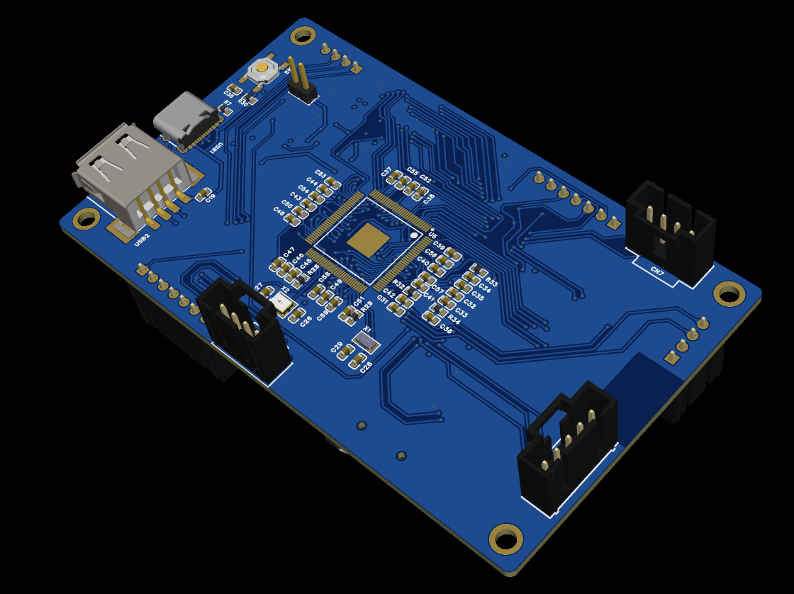
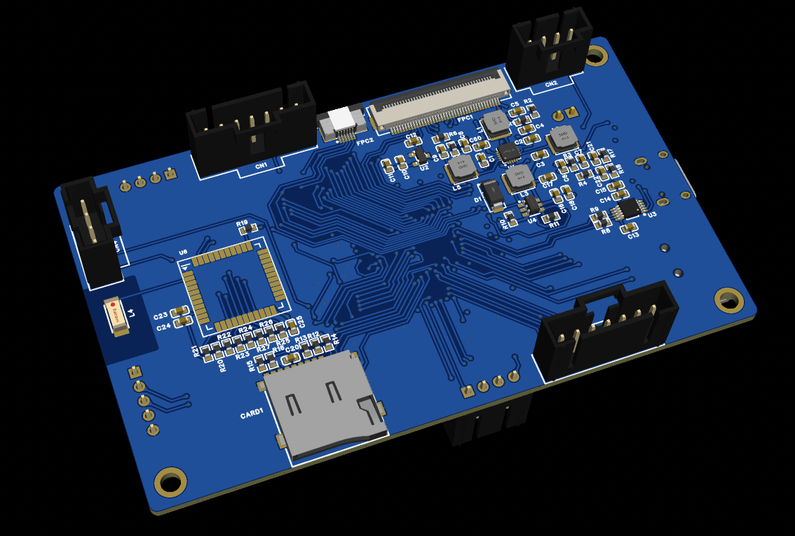
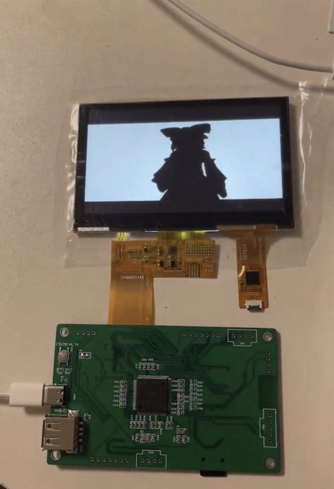

# little-pi

Allwinner V3s Linux Dev Board

## Material List
|name|num|
|----|----|
|Allwinner V3s|1|
|EA3036CQBR|1|
|XC6206P302MR|1|
|PT4103B23F|1|
|CH340E|1|
|24M Crystal Oscillator|1|
|32k Crystal Oscillator|1|
|RTL8723BS module|1|
|TF Card|1|
|Tact Switch|1|
|LCD RGB888 800x480|1|
|...|n|

## Functions
- LCD Display + Touch
- Audio Output
- UART Transport + USB Type-C Power support
- USB Transport
- WiFi + BT

## Schematic
[schematic pdf](SCH_Schematic-Little-Pi-Core-Borad.pdf)

## Preview

